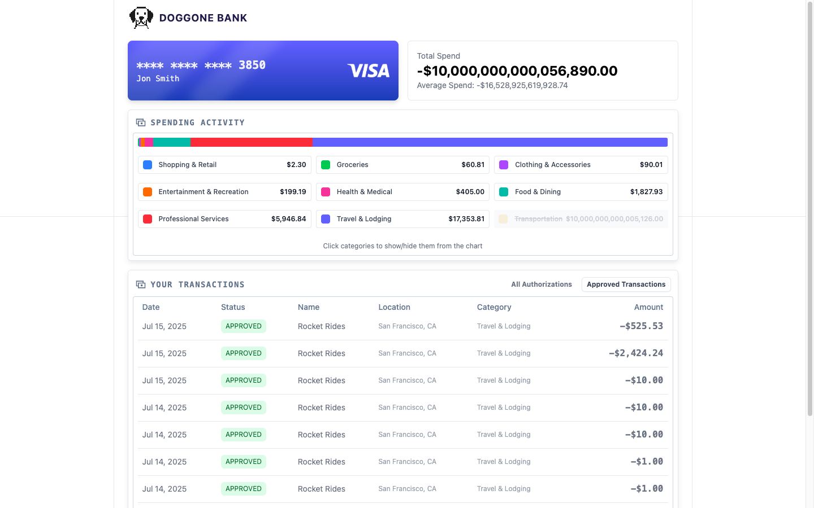
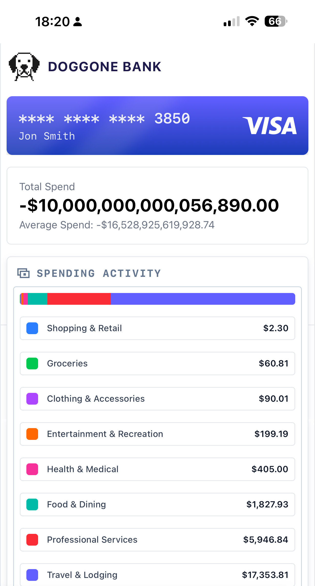

# Karat Challenge

A pnpm workspace with a React frontend and Elysia backend.

- Shows and allows a user all the completed transactions and all authorizations.
- Calculates the total spend on the card.
- Shows the average spend.
- Shows Categories of spend broken down by merchant code.
- Has mobile and desktop views (The list component is slightly different between the two).
  - Desktop View has pages
  - Mobile View is infinite scroll

## Demo Screenshots

### Desktop View



### Mobile View



## Structure

```
karat-challenge/
├── apps/
│   ├── frontend/          # React + TypeScript + Vite
│   └── backend/           # Elysia backend
├── packages/              # Shared packages (empty for now)
└── pnpm-workspace.yaml    # Workspace configuration
```

## Prerequisites

- Node.js >= 18.0.0
- pnpm >= 8.0.0

## Getting Started

1. Install dependencies:

   ```bash
   pnpm install
   ```

2. Start development servers:

   ```bash
   pnpm dev
   ```

   This will start:

   - Frontend at http://localhost:3000
   - Backend at http://localhost:3333

## Available Scripts

- `pnpm dev` - Start all development servers
- `pnpm build` - Build all apps
- `pnpm lint` - Lint all apps
- `pnpm type-check` - Type check all apps

## Individual App Commands

### Frontend (React + Vite)

```bash
cd apps/frontend
pnpm dev        # Start dev server
pnpm build      # Build for production
pnpm preview    # Preview production build
```

### Backend (Elysia)

```bash
cd apps/backend
pnpm dev         # Start dev server with hot reload
pnpm build       # Build for production
pnpm start       # Start production server
```

## Questions

### How else might you have improved your solution given more time?

- The pagination logic could use a bit more work. It's fine, and does what it's supposed to, but it'd be nice to track the pages a bit better. Kinda an issue with Stripe's API too. I basically forgot about useInfiniteQuery with React Query, and just threw a quick implementation of that in with the mobile view.

- Could set up webhooks and load transactions as they happen straight into the UI.

- I could always rabbit hole with more time on UI design.

- There's some small stuff with the UX of what's a Posted/Approved transaction and what's an authorization that could be clarified both with the API and the UI. Mainly that's handling the endge case with Stripe where the transactions are force completed. In a real-world scenario, authorizations _probably_ aren't forced through, so we could assume that Authorizations will contain all transactions. However, there are a lot of forced transactions, so they aren't surfaced with Authorizations.

- I started to go down the road of combining the two in the backend, but the IDs being different between the two objects in Stripe made that not super clean, so I didn't finish that. Fair critique if the expectation was to merge those two lists. If I were to do it, the cleanest way would be to have two filters `afterTransaction` and `afterAuthorization` and to make it work with React Query, we'd construct that on the frontend as `after=ipi_xxxx:iauth_xxxx` and then split it on the backend (the cursor based nature of React Query is the only reason I'd do it this way.)

### How might you have gone about further optimizing the load time of this view?

Caching. Frontend caches the transactions and data between page changes, but having a backend cache for transactions and reporting pieces would be a good move. Otherwise, there's not a ton to optimize.
The analytics/reporting cache would probably look to see what's the latest transaction, is it the same as the latest checked in the analytics?

- If yes: Send cached data.
- If no: There's a new transaction, recalculate.

You could do more continuous calculation of the analytics.

### Feedback and Calibration

**Approximately how many hours did you spend on this challenge?**

About 5 hours total. Mostly was rewatching Game of Thrones at the same time, so I don't think that's super reflective of how long this really would've taken if I sat down without distractions.

**What did you find most interesting / rewarding about this challenge?**

I like that it uses a real integration to work with, that's kinda fun.

**What did you find least interesting / rewarding about this challenge?**

I don't think there's anything that I'd really change. I don't really love spending 5 hours on something like this, but it's not a crazy ask.
